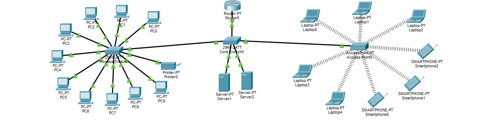
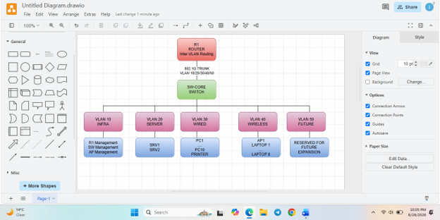

# CMPG 325 Network Project

## Mmila Vegetable Growers (Mahikeng)


## Student Information

| Field | Details |
|---|---|
| Student | Makutoane, AI |
| Student Number | 42510716 |
| Course | CMPG 325 - Computer Networks |
| Institution | North-West University |
| Project ID | CMPG325-2026-041 |
| Client ID | CLI-041 |
| Client | Mmila Vegetable Growers |
| Location | Mahikeng |
| Industry | Agriculture |

## Project Overview

This repository contains the design proposal, topology diagrams, IP addressing plan, Cisco Packet Tracer implementation, and supporting documentation for a computer network designed for Mmila Vegetable Growers in Mahikeng.

The proposed network is intended to provide reliable wired and wireless connectivity for the organisation’s staff and network devices. The design also considers the client’s heritage-listed building, anticipated user growth, and the requirement to implement and demonstrate a Wireless LAN.


## Repository Structure

```text
.
├── README.md
├── topology/
│   ├── physical-topology.png
│   └── logical-topology.png
├── packet-tracer/
│   ├── mmila-vegetable-growers.pkt
└── screenshots/
    ├── configuration/
    ├── connectivity/
    └── troubleshooting/
```


## Client Requirements

The proposed network must satisfy the following requirements:

- Provide reliable connectivity for wired and wireless devices.
- Enable communication between relevant devices, including PCs, laptops, servers, and the network printer.
- Support essential network services such as DHCP.
- Use the assigned IPv4 addressing block `192.168.27.0/24`.
- Respect the heritage-listed building constraint by avoiding new cabling through external walls.
- Accommodate a 25% increase in users without renumbering existing devices or subnets.
- Provide a working and testable Cisco Packet Tracer implementation.
- Document the network design, addressing plan, configuration, testing, and design decisions.
- Implement a Wireless LAN with access-point integration and adequate coverage.

### Wireless LAN

The wireless LAN is an important part of the design because it addresses both the client’s connectivity requirement and the heritage-building constraint.

The proposed wireless implementation includes:

- Access point `AP1` connected to the network switch using internal Ethernet cabling.
- A dedicated wireless VLAN, VLAN 40.
- An SSID for Mmila Vegetable Growers staff.
- Wireless security using an appropriate authentication method.
- DHCP for wireless clients.
- Central access-point placement to provide adequate coverage within the office.
- Connectivity testing between wireless clients, the gateway, servers, and other permitted devices.


## Proposed Network Design

### Physical Topology

The proposed physical topology is an extended star topology with a hybrid wireless element.

The central network devices consist of:

- One router, labelled `R1`.
- One core switch, labelled `SW-Core`.
- One access switch, labelled `SW-Access`.
- One wireless access point, labelled `AP1`.
- Two servers, labelled `Server1` and `Server2`.
- Wired desktop computers.
- One network printer.
- Five wireless laptops and three smartphones.

The router connects to the core switch. The core switch connects to the access switch, two servers, and the wireless access point. The access switch connects to the ten desktop PCs and the printer. The laptops and smartphones connect wirelessly to the access point without physical cabling.

All proposed network cabling is kept inside the building. Wireless connectivity is used to extend network access while respecting the heritage-listed building restriction.



### Logical Topology

The logical topology separates network traffic into VLANs according to device function. This improves organisation, manageability, and future scalability.

The proposed VLANs are:

| VLAN ID | VLAN Name | Purpose | Subnet |
|---:|---|---|---|
| 10 | INFRA | Infrastructure management | `192.168.27.0/27` |
| 20 | SERVER | Servers and critical services | `192.168.27.32/27` |
| 30 | WIRED | Wired PCs and printer | `192.168.27.64/26` |
| 40 | WIRELESS | Wireless clients | `192.168.27.128/26` |
| 50 | FUTURE | Reserved expansion network | `192.168.27.192/26` |

Router `R1` provides the default gateway for the network segments and performs inter-VLAN routing. The logical topology diagram shows which devices belong to each VLAN and how traffic is routed between the logical networks.




## IP Addressing Plan

The assigned address block is:

```text
Network:          192.168.27.0/24
Subnet mask:      255.255.255.0
Usable addresses: 192.168.27.1 - 192.168.27.254
Broadcast:        192.168.27.255
Total usable:     254 addresses
```

### Addressing Summary

| VLAN / Subnet | Network | Mask | Gateway | Static Addresses | DHCP Pool | Reserved or Future Use |
|---|---|---|---|---|---|---|
| INFRA (10) | `192.168.27.0/27` | `255.255.255.224` | `192.168.27.1` | R1: `.1`, SW-Core: `.2`, AP1: `.3` | Not used | `.4-.30` |
| SERVER (20) | `192.168.27.32/27` | `255.255.255.224` | `192.168.27.34` | Server1: `.33`, Server2: `.35` | Not used | `.36-.62` |
| WIRED (30) | `192.168.27.64/26` | `255.255.255.192` | `192.168.27.65` | Printer: `.66` | `.70-.120` | `.121-.126` |
| WIRELESS (40) | `192.168.27.128/26` | `255.255.255.192` | `192.168.27.129` | None required | `.135-.180` | `.130-.134` and `.181-.190` |
| FUTURE (50) | `192.168.27.192/26` | `255.255.255.192` | `192.168.27.193` | None currently | Not used | `.194-.254` |

The server subnet uses static addresses because servers should remain consistently reachable. Wired and wireless end-user devices use DHCP to simplify configuration and administration.


## Growth Accommodation

For the purpose of this design, I assume an initial deployment of approximately **21 user-type devices**, consisting of:

- Approximately 10-11 wired devices, including desktop computers and a printer.
- Approximately 8 wireless devices, including laptops or mobile devices.
- 2 servers.

The projected 25% growth is calculated as follows:

```text
21 × 1.25 = 26.25
```

The network should therefore support approximately **26-27 user-type devices** after growth.

The proposed addressing plan accommodates this requirement because:

- VLAN 20 provides 30 usable addresses for servers and services
- VLAN 30 provides 62 usable addresses for wired devices
- VLAN 40 provides 62 usable addresses for wireless devices
- VLAN 50 provides a separate `/26` subnet reserved for future expansion. 
- Existing subnets and device addresses do not need to be changed as new users are added.

## Router-on-a-Stick Configuration

Inter-VLAN routing was implemented using sub-interfaces on the router's `FastEthernet0/0` interface.

| Router Interface | VLAN | IP Address | Subnet Mask |
|---|---:|---|---|
| `Fa0/0.10` | 10 | `192.168.27.1` | `255.255.255.224` |
| `Fa0/0.20` | 20 | `192.168.27.34` | `255.255.255.224` |
| `Fa0/0.30` | 30 | `192.168.27.65` | `255.255.255.192` |
| `Fa0/0.40` | 40 | `192.168.27.129` | `255.255.255.192` |

The router acts as the default gateway for each active VLAN and enables communication between the VLANs.

## DHCP Configuration

DHCP was configured on the router for the wired and wireless user VLANs.

| DHCP Pool | Network | Gateway | Allocation Range |
|---|---|---|---|
| WIRED | `192.168.27.64/26` | `192.168.27.65` | `192.168.27.70–192.168.27.120` |
| WIRELESS | `192.168.27.128/26` | `192.168.27.129` | `192.168.27.135–192.168.27.180` |

Addresses used by gateways and static devices were excluded from the DHCP ranges.

## Static Addressing

| Device | Addressing Method | IP Address | Gateway |
|---|---|---|---|
| Server1 | Static | `192.168.27.33` | `192.168.27.34` |
| Server2 | Static | `192.168.27.35` | `192.168.27.34` |
| Printer | Static | `192.168.27.66` | `192.168.27.65` |

## Wireless LAN Implementation

The assigned networking challenge was Wireless LAN access-point integration and coverage.

| Setting | Configured Value |
|---|---|
| SSID | `Mmila_Wireless` |
| Frequency | 2.4 GHz |
| Channel | 6 |
| Security | WPA2-PSK |
| Encryption | AES |
| Wireless VLAN | VLAN 40 |
| Wireless clients | 5 laptops and 3 smartphones |
| DHCP range | `192.168.27.135–192.168.27.180` |

The access point is connected to the core switch using Ethernet. Wireless clients connect to the `Mmila_Wireless` SSID and receive their addresses from the VLAN 40 DHCP pool.

## Testing and Verification

The following tests were performed:

| Test | Result |
|---|---|
| Wired PC to wired gateway | Successful, 0% packet loss |
| Wired PC to printer | Successful, 0% packet loss |
| Wired PC to server | Successful after rerunning the initial test |
| Wireless laptop to wireless gateway | Successful, 0% packet loss |
| Wireless laptop to server | Successful, 0% packet loss |
| Wireless laptop to wired PC | Successful, 0% packet loss |
| Simple PDU tests | Successful |

Testing evidence is available in the `screenshots/connectivity/` folder.

## Troubleshooting

The following issues were identified and resolved:

- Wireless laptops required compatible wireless interfaces. The WPC300N modules were installed and configured.
- Smartphones required a different wireless configuration method using `Config-Wireless0`.
- Router sub-interfaces were required for inter-VLAN routing.
- Initial ping attempts could experience packet loss during address resolution. Tests were repeated after the network had learned the relevant addresses, and successful tests showed 0% loss.

## Packet Tracer Files

The final Packet Tracer implementation is available here:

[Download the final Packet Tracer file](packet-tracer/mmila-vegetable-growers.pkt)

The file includes the configured router, switches, servers, printer, PCs, wireless access point, laptops, and smartphones.

## Evidence

### Configuration Evidence

- [VLAN configuration](screenshots/configuration/vlan_core_switch.png)
- [Access-switch configuration](screenshots/configuration/vlan_access_switch.png)
- [Router sub-interfaces](screenshots/configuration/router_subinterfaces.png)
- [DHCP pools](screenshots/configuration/dhcp_pool.png)
- [DHCP bindings](screenshots/configuration/dhcp_binding.png)
- [Wireless access-point configuration](screenshots/configuration/wireless_ap_configuration.png)

### Testing Evidence

- [Wired Connectivity Ping Tests](screenshots/connectivity/wired_connectivity_ping_results.png)
- [Wireless Connectivity Ping Tests](screenshots/connectivity/wireless_connectivity_ping_results.png)
- [Simple PDU Tests](screenshots/connectivity/simple_pdu_results.png)


